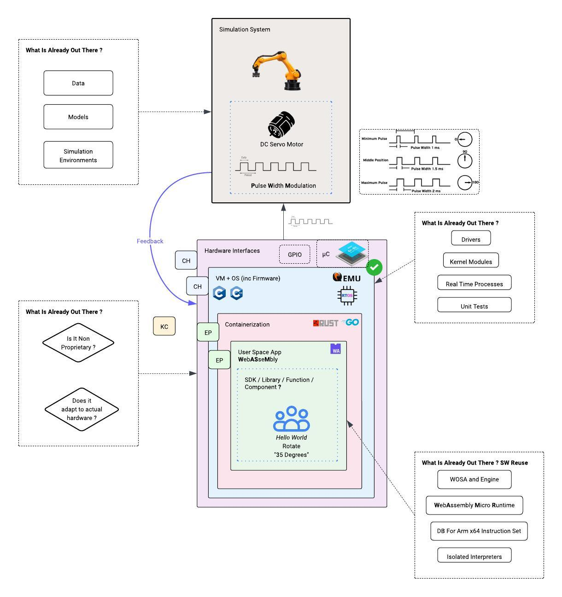

# Virtec

This monorepo is part of the Virtec virtualization intiative that aims to build an open source robotics development virtualization platform that speeds up collaboration across teams that typical wait for hardware to be provisioned.

Before anything else credit where its due , this doc uses this [Great Template](https://github.com/PurpleBooth/a-good-readme-template/blob/main/README.md) there's a really strong chance that this will be used EVERYWHERE.

##  System Design

## Raspberry Pi Zero 2 Zephyr OS Firmware Load Instructions

From Gemini 3 Fast / Flash 

'''
The Initial Setup (SD Card)
Before you can use JTAG or OpenOCD, the Raspberry Pi hardware needs a way to boot. Unlike a standard microcontroller (like an STM32) that has built-in flash memory, the Pi Zero 2 boots from the microSD Card.
• Step A: Format an SD card to FAT32.
• Step B: You must include the standard Raspberry Pi "bootloader" files (usually found in a Raspbian image or the RPi Firmware Repo):
• bootcode.bin
• start.elf
• fixup.dat
• Step C: Rename your compiled Zephyr binary (zephyr.bin) to kernel8.img (for 64-bit) and place it on the root of the SD card.
• Step D: Create a config.txt file on the SD card to tell the Pi how to boot your kernel.
'''

## Built With

  <!-- - [Contributor Covenant](https://www.contributor-covenant.org/) - Used
    for the Code of Conduct
  - [Creative Commons](https://creativecommons.org/) - Used to choose
    the license -->

## Contributing

<!-- Please read [CONTRIBUTING.md](CONTRIBUTING.md) for details on our code
of conduct, and the process for submitting pull requests to us. -->

## Versioning

<!-- We use [Semantic Versioning](http://semver.org/) for versioning. For the versions
available, see the [tags on this
repository](https://github.com/PurpleBooth/a-good-readme-template/tags). -->

## Authors

  - **Kunwar Chowhan** - *First Author* -
    <!-- [PurpleBooth](https://github.com/PurpleBooth) -->

See also the list of
[contributors](https://github.com/PurpleBooth/a-good-readme-template/contributors)
who participated in this project.

## License

<!-- This project is licensed under the [CC0 1.0 Universal](LICENSE.md)
Creative Commons License - see the [LICENSE.md](LICENSE.md) file for
details -->

## Acknowledgments

  <!-- - Hat tip to anyone whose code is used
  - Inspiration
  - etc -->
